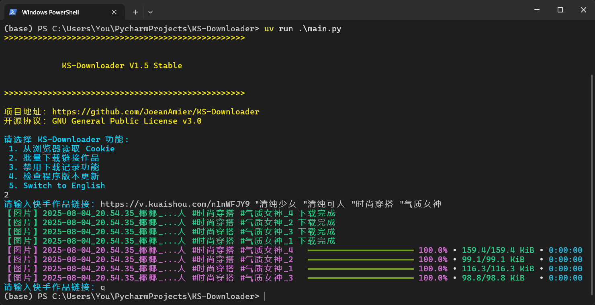

 
<h1>KS-Downloader</h1>

简体中文 | <a href="README_EN.md">English</a>

 

 

🔥 <b>快手作品下载工具：</b>完全免费开源，基于 HTTPX 模块实现，下载快手无水印视频、图片文件！

<h1>📑 项目功能</h1>
<ul>
<li>✅ 下载快手无水印作品文件</li>
<li>☑️ 下载快手作品封面图片</li>
<li>☑️ 下载快手作品音乐文件</li>
<li>✅ 自动跳过已下载的作品文件</li>
<li>✅ 作品文件完整性处理机制</li>
<li>✅ 持久化储存作品信息至文件</li>
<li>✅ 记录已下载作品 ID</li>
<li>✅ 支持文件断点续传下载</li>
<li>✅ 作品文件储存至单独文件夹</li>
<li>✅ 自定义作品文件名称格式</li>
<li>✅ 从浏览器读取 Cookie</li>
<li>✅ 支持设置作者别名</li>
<li>✅ 按作者归档保存作品</li>
<li>✅ 自动更新作者昵称</li>
<li>✅ 支持 API 调用功能</li>
<li>☑️ 后台监听剪贴板下载作品</li>
</ul>
<h1>📸 程序截图</h1>

<a href="https://www.bilibili.com/video/BV1LYtbzhESo/">前往 bilibili 观看演示</a>；<a href="https://youtu.be/twiy9cv5snA">前往 YouTube 观看演示</a>

<h1>🥣 使用方法</h1>
<h2>🖱 程序运行</h2>

⭐ Mac OS、Windows 10 及以上用户可前往 <a href="https://github.com/JoeanAmier/KS-Downloader/releases/latest">Releases</a> 或者 <a href="https://github.com/JoeanAmier/KS-Downloader/actions">Actions</a> 下载程序压缩包，解压后打开程序文件夹，双击运行 <code>main</code> 即可使用！

⭐ 本项目包含自动构建可执行文件的 GitHub Actions，使用者可以随时使用 GitHub Actions 将最新源码构建为可执行文件！

⭐ 自动构建可执行文件教程请查阅本文档的 <code>构建可执行文件指南</code> 部分；如果需要更加详细的图文教程，请 <a href="https://mp.weixin.qq.com/s/TorfoZKkf4-x8IBNLImNuw">查阅文章</a>！

<strong>注意：Mac OS 平台可执行文件 <code>main</code> 可能需要从终端命令行启动；受设备限制，Mac OS 平台可执行文件尚未经过测试，无法保证可用性！</strong>

若通过此方式使用程序，文件默认下载路径为：<code>.\_internal\Volume\Download</code>；配置文件路径为：<code>.\_internal\Volume\config.yaml</code>

<h3>程序更新</h3>

<strong>方案一：</strong>下载并解压文件，将旧版本的 <code>_internal\Volume</code> 文件夹复制到新版本的 <code>_internal</code> 文件夹。

<strong>方案二：</strong>下载并解压文件（不要运行程序），复制全部文件，直接覆盖旧版本文件。

<h2>⌨️ 源码运行</h2>
<ol>

[//]: # (<li>安装版本号不低于 <code>3.12</code> 的 Python 解释器</li>)
<li>安装版本号为 <code>3.12</code> 的 Python 解释器</li>
<li>下载本项目最新的源码或 <a href="https://github.com/JoeanAmier/KS-Downloader/releases/latest">Releases</a> 发布的源码至本地</li>
<li>打开终端，切换至项目根路径</li>
<li>运行 <code>pip install -i https://pypi.tuna.tsinghua.edu.cn/simple -r requirements.txt</code> 命令安装程序所需模块</li>
<li>运行 <code>main.py</code> 即可使用</li>
</ol>
<h2>⌨️ Docker 运行</h2>
<ol>
<li>获取镜像</li>
<ul>
<li>方式一：使用 <code>Dockerfile</code> 文件构建镜像</li>
<li>方式二：使用 <code>docker pull joeanamier/ks-downloader</code> 命令拉取镜像</li>
<li>方式三：使用 <code>docker pull ghcr.io/joeanamier/ks-downloader</code> 命令拉取镜像</li>
</ul>
<li>创建容器</li>
<ul>
<li>TUI 模式：<code>docker run --name 容器名称(可选) -p 主机端口号:5557 -v ks_downloader_volume:/app/Volume -it &lt;镜像名称&gt;</code></li>
<li>API 模式：<code>docker run --name 容器名称(可选) -p 主机端口号:5557 -v ks_downloader_volume:/app/Volume -it &lt;镜像名称&gt; python main.py api</code></li>
 <b>注意：</b>此处的 <code>&lt;镜像名称&gt;</code> 需与您在第一步中使用的镜像名称保持一致（<code>joeanamier/ks-downloader</code> 或 <code>ghcr.io/joeanamier/ks-downloader</code>）
</ul>
<li>运行容器
<ul>
<li>启动容器：<code>docker start -i 容器名称/容器 ID</code></li>
<li>重启容器：<code>docker restart -i 容器名称/容器 ID</code></li>
</ul>
</li>
</ol>

Docker 运行项目时不支持 <b>从浏览器读取 Cookie</b>，无法使用 <b>监听剪贴板</b> 功能，可以正常粘贴内容，其他功能如有异常请反馈！

<h2>🖥 服务器模式</h2>

<b>启动：</b>运行命令：<code>python .\main.py api</code>

<b>关闭：</b>按下 <code>Ctrl</code> + <code>C</code> 关闭服务器

访问 <code>http://127.0.0.1:5557/docs</code> 或者 <code>http://127.0.0.1:5557/redoc</code>；你会看到自动生成的交互式 API 文档！

<h1>🔗 支持链接</h1>
<ul>
<li><code>https://www.kuaishou.com/f/分享码</code></li>
<li><code>https://v.kuaishou.com/分享码</code></li>
<li><code>https://www.kuaishou.com/short-video/作品ID</code></li>
<li><code>https://kuaishou.cn/short-video/作品ID</code></li>
<li><code>https://live.kuaishou.com/u/作者ID/作品ID</code></li>
 

<b>推荐使用分享链接；支持单次输入多个作品链接，链接之间使用空格分隔。</b>

</ul>
<h1>🪟 关于终端</h1>

⭐ 推荐使用 <a href="https://learn.microsoft.com/zh-cn/windows/terminal/install">Windows 终端</a> （Windows 11 默认终端）运行程序以便获得最佳显示效果！

<h1>📜 其他说明</h1>
<ul>
<li>Windows 系统需要以管理员身份运行程序才能读取 Chromium、Chrome、Edge 浏览器 Cookie</li>
<li>如果开启保存作品数据至文件功能，作品数据默认储存至 <code>./Volume/Data/DetailData.db</code> 文件</li>
<li>程序设置、下载记录数据储存至 <code>./Volume/KS-Downloader.db</code> 文件</li>
<li>项目内置请求延时机制，以避免请求频率过快，代码位置：<code>./source/tools/sleep.py</code></li>
</ul>
<h1>⚙️ 配置文件</h1>

项目根目录下的 <code>config.yaml</code> 文件，首次运行自动生成，可以自定义部分运行参数。

<b>如果项目功能无法正常使用，请尝试配置 Cookie 后再使用！</b>

<table>
<thead>
<tr>
<th align="center">参数</th>
<th align="center">类型</th>
<th align="center">含义</th>
<th align="center">默认值</th>
</tr>
</thead>
<tbody>
<tr>
<td align="center">mapping_data</td>
<td align="center">str: str</td>
<td align="center"><a href="#author_archive">#</a>作者别名映射表，格式：<code>作者ID: 作者别名</code></td>
<td align="center">无</td>
</tr>
<tr>
<td align="center">work_path</td>
<td align="center">str</td>
<td align="center">作品数据 / 文件保存根路径</td>
<td align="center">项目根路径/Volume</td>
</tr>
<tr>
<td align="center">folder_name</td>
<td align="center">str</td>
<td align="center">作品文件储存文件夹名称</td>
<td align="center">Download</td>
</tr>
<tr>
<td align="center">name_format</td>
<td align="center">str</td>
<td align="center">作品文件名称格式，使用空格分隔字段；支持字段：<code>作品类型</code>、<code>作者昵称</code>、<code>作者ID</code>、<code>作品描述</code>、<code>作品ID</code>、<code>发布日期</code></td>
<td align="center"><code>发布日期 作者昵称 作品描述</code></td>
</tr>
<tr>
<td align="center">name_length</td>
<td align="center">int</td>
<td align="center">作品文件名称长度限制，超出限制的文本将被截断，设置过大的值时请确保系统支持此长度</td>
<td align="center"><code>128</code></td>
</tr>
<tr>
<td align="center">cookie</td>
<td align="center">str</td>
<td align="center">快手网页版 Cookie，<b>无需登录</b></td>
<td align="center">动态获取</td>
</tr>
<tr>
<td align="center">proxy</td>
<td align="center">str</td>
<td align="center">设置程序代理</td>
<td align="center">null</td>
</tr>
<tr>
<td align="center">data_record</td>
<td align="center">bool</td>
<td align="center">是否保存作品数据至文件，文件类型：<code>SQLite</code></td>
<td align="center">false</td>
</tr>
<tr>
<td align="center">max_workers</td>
<td align="center">int</td>
<td align="center">同时下载作品文件的最大任务数</td>
<td align="center">4</td>
</tr>
<tr>
<td align="center"><del>cover</del>（停用）</td>
<td align="center">str</td>
<td align="center">作品封面下载格式，支持：<code>JPEG</code>、<code>WEBP</code>；设置为空字符串代表不下载</td>
<td align="center">空字符串</td>
</tr>
<tr>
<td align="center"><del>music</del>（停用）</td>
<td align="center">bool</td>
<td align="center">是否下载作品音乐</td>
<td align="center">false</td>
</tr>
<tr>
<td align="center">max_retry</td>
<td align="center">int</td>
<td align="center">请求数据失败时，重试的最大次数，单位：秒</td>
<td align="center">5</td>
</tr>
<tr>
<td align="center">timeout</td>
<td align="center">int</td>
<td align="center">请求数据超时限制，单位：秒</td>
<td align="center">10</td>
</tr>
<tr>
<td align="center">user_agent</td>
<td align="center">str</td>
<td align="center">浏览器 User Agent</td>
<td align="center">默认 UA</td>
</tr>
<tr>
<td align="center">chunk</td>
<td align="center">int</td>
<td align="center">下载文件时，每次从服务器获取的数据块大小，单位：字节</td>
<td align="center">2097152(2 MB)</td>
</tr>
<tr>
<td align="center">folder_mode</td>
<td align="center">bool</td>
<td align="center">是否将每个作品的文件储存至单独的文件夹；文件夹名称与文件名称保持一致</td>
<td align="center">false</td>
</tr>
<tr>
<td align="center">author_archive</td>
<td align="center">bool</td>
<td align="center"><a href="#author_archive">#</a>是否将每个作者的作品储存至单独的文件夹；文件夹名称格式：<code>作者ID_作者昵称</code></td>
<td align="center">false</td>
</tr>
</tbody>
</table>

如果 <code>author_archive</code> 参数设置为 <code>true</code>，程序会把每个作者的作品储存至单独的文件夹；当作者的昵称发生变化时，程序会自动更新已下载作品文件名称中的作者昵称部分！

除此之外，你还可以通过设置 <code>mapping_data</code> 参数为某个作者设置别名；如果对某个作者设置了别名，程序会使用你设置的作者别名去替代作者昵称！

# 📦 构建可执行文件指南

本指南将引导您通过 Fork 本仓库并执行 GitHub Actions 自动完成基于最新源码的程序构建和打包！

---

## 使用步骤

### 1. Fork 本仓库

1. 点击项目仓库右上角的 **Fork** 按钮，将本仓库 Fork 到您的个人 GitHub 账户中
2. 您的 Fork 仓库地址将类似于：`https://github.com/your-username/this-repo`

---

### 2. 启用 GitHub Actions

1. 前往您 Fork 的仓库页面
2. 点击顶部的 **Settings** 选项卡
3. 点击右侧的 **Actions** 选项卡
4. 点击 **General** 选项
5. 在 **Actions permissions** 下，选择 **Allow all actions and reusable workflows** 选项，点击 **Save** 按钮

---

### 3. 手动触发打包流程

1. 在您 Fork 的仓库中，点击顶部的 **Actions** 选项卡
2. 找到名为 **构建可执行文件** 的工作流
3. 点击右侧的 **Run workflow** 按钮：
    - 选择 **master** 或者 **develop** 分支
    - 点击 **Run workflow**

---

### 4. 查看打包进度

1. 在 **Actions** 页面中，您可以看到触发的工作流运行记录
2. 点击运行记录，查看详细的日志以了解打包进度和状态

---

### 5. 下载打包结果

1. 打包完成后，进入对应的运行记录页面
2. 在页面底部的 **Artifacts** 部分，您将看到打包的结果文件
3. 点击下载并保存到本地，即可获得打包好的程序

---

## 注意事项

1. **资源使用**：
    - Actions 的运行环境由 GitHub 免费提供，普通用户每月有一定的免费使用额度（2000 分钟）

2. **代码修改**：
    - 您可以自由修改 Fork 仓库中的代码以定制程序打包流程
    - 修改后重新触发打包流程，您将得到自定义的构建版本

3. **与主仓库保持同步**：
    - 如果主仓库更新了代码或工作流，建议您定期同步 Fork 仓库以获取最新功能和修复

---

## Actions 常见问题

### Q1: 为什么我无法触发工作流？

A: 请确认您已按照步骤 **启用 Actions**，否则 GitHub 会禁止运行工作流

### Q2: 打包流程失败怎么办？

A:

- 检查运行日志，了解失败原因
- 确保代码没有语法错误或依赖问题
- 如果问题仍未解决，可以在本仓库的 [Issues 页面](https://github.com/JoeanAmier/XHS-Downloader/issues) 提出问题

### Q3: 我可以直接使用主仓库的 Actions 吗？

A: 由于权限限制，您无法直接触发主仓库的 Actions。请通过 Fork 仓库的方式执行打包流程

# ⚠️ 免责声明

<ol>
<li>使用者对本项目的使用由使用者自行决定，并自行承担风险。作者对使用者使用本项目所产生的任何损失、责任、或风险概不负责。</li>
<li>本项目的作者提供的代码和功能是基于现有知识和技术的开发成果。作者按现有技术水平努力确保代码的正确性和安全性，但不保证代码完全没有错误或缺陷。</li>
<li>本项目依赖的所有第三方库、插件或服务各自遵循其原始开源或商业许可，使用者需自行查阅并遵守相应协议，作者不对第三方组件的稳定性、安全性及合规性承担任何责任。</li>
<li>使用者在使用本项目时必须严格遵守 <a href="https://github.com/JoeanAmier/KS-Downloader/blob/master/LICENSE">GNU
    General Public License v3.0</a> 的要求，并在适当的地方注明使用了 <a
        href="https://github.com/JoeanAmier/KS-Downloader/blob/master/LICENSE">GNU General Public License
    v3.0</a> 的代码。
</li>
<li>使用者在使用本项目的代码和功能时，必须自行研究相关法律法规，并确保其使用行为合法合规。任何因违反法律法规而导致的法律责任和风险，均由使用者自行承担。</li>
<li>使用者不得使用本工具从事任何侵犯知识产权的行为，包括但不限于未经授权下载、传播受版权保护的内容，开发者不参与、不支持、不认可任何非法内容的获取或分发。</li>
<li>本项目不对使用者涉及的数据收集、存储、传输等处理活动的合规性承担责任。使用者应自行遵守相关法律法规，确保处理行为合法正当；因违规操作导致的法律责任由使用者自行承担。</li>
<li>使用者在任何情况下均不得将本项目的作者、贡献者或其他相关方与使用者的使用行为联系起来，或要求其对使用者使用本项目所产生的任何损失或损害负责。</li>
<li>本项目的作者不会提供 KS-Downloader 项目的付费版本，也不会提供与 KS-Downloader 项目相关的任何商业服务。</li>
<li>基于本项目进行的任何二次开发、修改或编译的程序与原创作者无关，原创作者不承担与二次开发行为或其结果相关的任何责任，使用者应自行对因二次开发可能带来的各种情况负全部责任。</li>
<li>本项目不授予使用者任何专利许可；若使用本项目导致专利纠纷或侵权，使用者自行承担全部风险和责任。未经作者或权利人书面授权，不得使用本项目进行任何商业宣传、推广或再授权。</li>
<li>作者保留随时终止向任何违反本声明的使用者提供服务的权利，并可能要求其销毁已获取的代码及衍生作品。</li>
<li>作者保留在不另行通知的情况下更新本声明的权利，使用者持续使用即视为接受修订后的条款。</li>
</ol>
<b>在使用本项目的代码和功能之前，请您认真考虑并接受以上免责声明。如果您对上述声明有任何疑问或不同意，请不要使用本项目的代码和功能。如果您使用了本项目的代码和功能，则视为您已完全理解并接受上述免责声明，并自愿承担使用本项目的一切风险和后果。</b>

# ✉️ 联系作者

<ul>
<li>作者邮箱：yonglelolu@foxmail.com</li>
<li>作者微信: Downloader_Tools</li>
<li>微信公众号: Downloader Tools</li>
<li><b>Discord 社区</b>: <a href="https://discord.com/invite/ZYtmgKud9Y">点击加入社区</a></li>
</ul>

✨ <b>作者的其他开源项目：</b>

<ul>
<li><b>DouK-Downloader（抖音、TikTok）</b>：<a href="https://github.com/JoeanAmier/TikTokDownloader">https://github.com/JoeanAmier/TikTokDownloader</a></li>
<li><b>XHS-Downloader（小红书、XiaoHongShu、RedNote）</b>：<a href="https://github.com/JoeanAmier/XHS-Downloader">https://github.com/JoeanAmier/XHS-Downloader</a></li>
</ul>
<h1>⭐ Star 趋势</h1>

# ♥️ 支持项目

如果 <b>KS-Downloader</b> 对您有帮助，请考虑为它点个 <b>Star</b> ⭐，感谢您的支持！

<table>
<thead>
<tr>
<th align="center">微信(WeChat)</th>
<th align="center">支付宝(Alipay)</th>
</tr>
</thead>
<tbody><tr>
<td align="center"></td>
<td align="center"></td>
</tr>
</tbody>
</table>

如果您愿意，可以考虑提供资助为 <b>KS-Downloader</b> 提供额外的支持！

# 🌟 贡献指南

**欢迎对本项目做出贡献！为了保持代码库的整洁、高效和易于维护，请仔细阅读以下指南，以确保您的贡献能够顺利被接受和整合。**

* 在开始开发前，请从 `develop` 分支拉取最新的代码，以此为基础进行修改；这有助于避免合并冲突并保证您的改动基于最新的项目状态。
* 如果您的更改涉及多个不相关的功能或问题，请将它们分成多个独立的提交或拉取请求。
* 每个拉取请求应尽可能专注于单一功能或修复，以便于代码审查和测试。
* 遵循现有的代码风格；请确保您的代码与项目中已有的代码风格保持一致；建议使用 Ruff 工具保持代码格式规范。
* 编写可读性强的代码；添加适当的注释帮助他人理解您的意图。
* 每个提交都应该包含一个清晰、简洁的提交信息，以描述所做的更改。提交信息应遵循以下格式：`<类型>: <简短描述>`
* 当您准备提交拉取请求时，请优先将它们提交到 `develop` 分支；这是为了给维护者一个缓冲区，在最终合并到 `master`
  分支之前进行额外的测试和审查。
* 建议在开发前或遇到疑问时与作者沟通，确保开发方向一致，避免重复劳动或无效提交。

**参考资料：**

* [贡献者公约](https://www.contributor-covenant.org/zh-cn/version/2/1/code_of_conduct/)
* [如何为开源做贡献](https://opensource.guide/zh-hans/how-to-contribute/)

# 💡 项目参考

* https://github.com/moyada/stealer
* https://github.com/encode/httpx/
* https://github.com/Textualize/rich
* https://github.com/Tinche/aiofiles
* https://github.com/omnilib/aiosqlite
* https://github.com/pyinstaller/pyinstaller
* https://github.com/thewh1teagle/rookie
* https://github.com/lxml/lxml
* https://github.com/yaml/pyyaml
* https://github.com/carpedm20/emoji/
