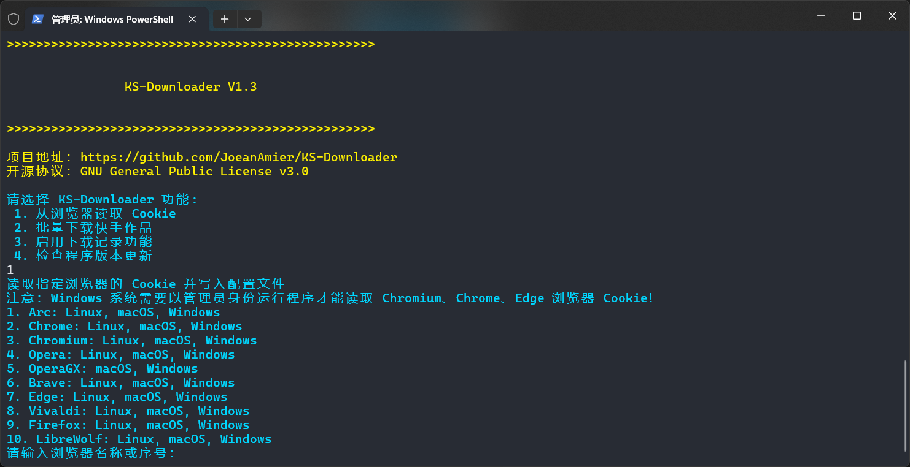

 
<h1>KS-Downloader</h1>

 

 

🔥 <b>快手作品下载工具：</b>完全免费开源，基于 HTTPX 模块实现，下载快手无水印视频、图片文件！

⭐ 本项目完全免费开源，无任何收费功能，请勿上当受骗！

<h1>📑 项目功能</h1>
<ul>
<li>✅ 下载快手无水印作品文件</li>
<li>☑️ 下载快手作品封面图片</li>
<li>☑️ 下载快手作品音乐文件</li>
<li>✅ 自动跳过已下载的作品文件</li>
<li>✅ 作品文件完整性处理机制</li>
<li>✅ 持久化储存作品信息至文件</li>
<li>✅ 记录已下载作品 ID</li>
<li>✅ 支持文件断点续传下载</li>
<li>✅ 作品文件储存至单独文件夹</li>
<li>✅ 自定义作品文件名称格式</li>
<li>✅ 从浏览器读取 Cookie</li>
<li>☑️ 后台监听剪贴板下载作品</li>
<li>☑️ 支持命令行下载作品文件</li>
<li>☑️ 支持 API 调用功能</li>
</ul>

⭐ KS-Downloader 开发计划及进度可前往 <a href="https://github.com/users/JoeanAmier/projects/6">Projects</a> 查阅

<h1>📸 程序截图</h1>

<h1>🥣 使用方法</h1>
<h2>🖱 程序运行</h2>

Mac OS、Windows 10 及以上用户可前往 <a href="https://github.com/JoeanAmier/KS-Downloader/releases/latest">Releases</a> 下载程序压缩包，解压后打开程序文件夹，双击运行 <code>main</code> 即可使用。

<strong>注意：Mac OS 平台可执行文件 <code>main</code> 可能需要从终端命令行启动；受设备限制，Mac OS 平台可执行文件尚未经过测试，无法保证可用性！</strong>

若通过此方式使用程序，文件默认下载路径为：<code>.\_internal\Download</code>；配置文件路径为：<code>.\_internal\config.yaml</code>

<h2>⌨️ 源码运行</h2>
<ol>
<li>安装版本号不低于 <code>3.12</code> 的 Python 解释器</li>
<li>下载本项目最新的源码或 <a href="https://github.com/JoeanAmier/KS-Downloader/releases/latest">Releases</a> 发布的源码至本地</li>
<li>打开终端，切换至项目根路径</li>
<li>运行 <code>pip install -i https://pypi.tuna.tsinghua.edu.cn/simple -r requirements.txt</code> 命令安装程序所需模块</li>
<li>运行 <code>main.py</code> 即可使用</li>
</ol>
<h1>🔗 支持链接</h1>
<ul>
<li><code>https://www.kuaishou.com/f/分享码</code></li>
<li><code>https://v.kuaishou.com/分享码</code></li>
<li><code>https://www.kuaishou.com/short-video/作品ID</code></li>
<li><code>https://kuaishou.cn/short-video/作品ID</code></li>
 

<b>推荐使用分享链接；支持单次输入多个作品链接，链接之间使用空格分隔。</b>

</ul>
<h1>🪟 关于终端</h1>

⭐ 推荐使用 <a href="https://learn.microsoft.com/zh-cn/windows/terminal/install">Windows 终端</a> （Windows 11 默认终端）运行程序以便获得最佳显示效果！

<h1>⚠️ 其他说明</h1>
<ul>
<li>Windows 系统需要以管理员身份运行程序才能读取 Chromium、Chrome、Edge 浏览器 Cookie</li>
</ul>
<h1>⚙️ 配置文件</h1>

项目根目录下的 <code>config.yaml</code> 文件，首次运行自动生成，可以自定义部分运行参数。

<b>如果项目功能无法正常使用，请尝试配置 Cookie 后再使用！</b>

<table>
<thead>
<tr>
<th align="center">参数</th>
<th align="center">类型</th>
<th align="center">含义</th>
<th align="center">默认值</th>
</tr>
</thead>
<tbody>
<tr>
<td align="center">work_path</td>
<td align="center">str</td>
<td align="center">作品数据 / 文件保存根路径</td>
<td align="center">项目根路径</td>
</tr>
<tr>
<td align="center">folder_name</td>
<td align="center">str</td>
<td align="center">作品文件储存文件夹名称</td>
<td align="center">Download</td>
</tr>
<tr>
<td align="center">name_format</td>
<td align="center">str</td>
<td align="center">作品文件名称格式，使用空格分隔字段；支持字段：<code>作品类型</code>、<code>作者昵称</code>、<code>作者ID</code>、<code>作品描述</code>、<code>作品ID</code>、<code>发布日期</code></td>
<td align="center"><code>发布日期 作者昵称 作品描述</code></td>
</tr>
<tr>
<td align="center">cookie</td>
<td align="center">str</td>
<td align="center">快手网页版 Cookie，<b>无需登录</b></td>
<td align="center">动态获取</td>
</tr>
<tr>
<td align="center">proxy</td>
<td align="center">str</td>
<td align="center">设置程序代理</td>
<td align="center">null</td>
</tr>
<tr>
<td align="center">download_record</td>
<td align="center">bool</td>
<td align="center">是否记录已下载作品 ID，如果启用，将会自动跳过已下载的作品</td>
<td align="center">true</td>
</tr>
<tr>
<td align="center">data_record</td>
<td align="center">bool</td>
<td align="center">是否保存作品数据至文件，文件类型：<code>SQLite</code></td>
<td align="center">false</td>
</tr>
<tr>
<td align="center">max_workers</td>
<td align="center">int</td>
<td align="center">同时下载作品文件的最大任务数</td>
<td align="center">4</td>
</tr>
<tr>
<td align="center"><del>cover</del></td>
<td align="center">str</td>
<td align="center">作品封面下载格式，支持：<code>JPEG</code>、<code>WEBP</code>；设置为空字符串代表不下载</td>
<td align="center">空字符串</td>
</tr>
<tr>
<td align="center"><del>music</del></td>
<td align="center">bool</td>
<td align="center">是否下载作品音乐</td>
<td align="center">false</td>
</tr>
<tr>
<td align="center">max_retry</td>
<td align="center">int</td>
<td align="center">请求数据失败时，重试的最大次数，单位：秒</td>
<td align="center">5</td>
</tr>
<tr>
<td align="center">timeout</td>
<td align="center">int</td>
<td align="center">请求数据超时限制，单位：秒</td>
<td align="center">10</td>
</tr>
<tr>
<td align="center">chunk</td>
<td align="center">int</td>
<td align="center">下载文件时，每次从服务器获取的数据块大小，单位：字节</td>
<td align="center">2097152(2 MB)</td>
</tr>
<tr>
<td align="center">folder_mode</td>
<td align="center">bool</td>
<td align="center">是否将每个作品的文件储存至单独的文件夹；文件夹名称与文件名称保持一致</td>
<td align="center">false</td>
</tr>
</tbody>
</table>

# ⚠️ 免责声明\(Disclaimers\)

<ul>
<li>使用者对本项目的使用由使用者自行决定，并自行承担风险。作者对使用者使用本项目所产生的任何损失、责任、或风险概不负责。</li>
<li>本项目的作者提供的代码和功能是基于现有知识和技术的开发成果。作者尽力确保代码的正确性和安全性，但不保证代码完全没有错误或缺陷。</li>
<li>使用者在使用本项目时必须严格遵守 <a href="https://github.com/JoeanAmier/KS-Downloader/blob/master/license">GNU
    General Public License v3.0</a> 的要求，并在适当的地方注明使用了 <a
        href="https://github.com/JoeanAmier/KS-Downloader/blob/master/license">GNU General Public License
    v3.0</a> 的代码。
</li>
<li>使用者在任何情况下均不得将本项目的作者、贡献者或其他相关方与使用者的使用行为联系起来，或要求其对使用者使用本项目所产生的任何损失或损害负责。</li>
<li>使用者在使用本项目的代码和功能时，必须自行研究相关法律法规，并确保其使用行为合法合规。任何因违反法律法规而导致的法律责任和风险，均由使用者自行承担。</li>
<li>本项目的作者不会提供 KS-Downloader 项目的付费版本，也不会提供与 KS-Downloader 项目相关的任何商业服务。</li>
<li>基于本项目进行的任何二次开发、修改或编译的程序与原创作者无关，原创作者不承担与二次开发行为或其结果相关的任何责任，使用者应自行对因二次开发可能带来的各种情况负全部责任。</li>
</ul>
<b>在使用本项目的代码和功能之前，请您认真考虑并接受以上免责声明。如果您对上述声明有任何疑问或不同意，请不要使用本项目的代码和功能。如果您使用了本项目的代码和功能，则视为您已完全理解并接受上述免责声明，并自愿承担使用本项目的一切风险和后果。</b>

# ✉️ 联系作者\(Contact\)

<ul>
<li>作者邮箱：yonglelolu@foxmail.com</li>
<li>作者微信: Downloader_Tools</li>
<li>微信公众号: Downloader Tools</li>
<li><b>Discord 社区</b>: <a href="https://discord.com/invite/ZYtmgKud9Y">点击加入社区</a></li>
</ul>

✨ <b>作者的其他开源项目：</b>

<ul>
<li><b>TikTokDownloader（抖音、TikTok）</b>：<a href="https://github.com/JoeanAmier/TikTokDownloader">https://github.com/JoeanAmier/TikTokDownloader</a></li>
<li><b>XHS-Downloader（小红书）</b>：<a href="https://github.com/JoeanAmier/XHS-Downloader">https://github.com/JoeanAmier/XHS-Downloader</a></li>
</ul>

# ♥️ 支持项目\(Support\)

如果 <b>KS-Downloader</b> 对您有帮助，请考虑为它点个 <b>Star</b> ⭐，感谢您的支持！

<table>
<thead>
<tr>
<th align="center">微信(WeChat)</th>
<th align="center">支付宝(Alipay)</th>
</tr>
</thead>
<tbody><tr>
<td align="center"></td>
<td align="center"></td>
</tr>
</tbody>
</table>

如果您愿意，可以考虑提供资助为 <b>KS-Downloader</b> 提供额外的支持！

# 💰 项目赞助\(Sponsor\)

**JetBrains** 支持全球开源社区认可的活跃项目，并为非商业开发提供免费许可证。

# 💡 项目参考\(Refer\)

* https://github.com/moyada/stealer
* https://github.com/encode/httpx/
* https://github.com/Textualize/rich
* https://github.com/Tinche/aiofiles
* https://github.com/omnilib/aiosqlite
* https://github.com/pyinstaller/pyinstaller
* https://github.com/thewh1teagle/rookie
* https://github.com/lxml/lxml
* https://github.com/yaml/pyyaml
* https://github.com/carpedm20/emoji/
