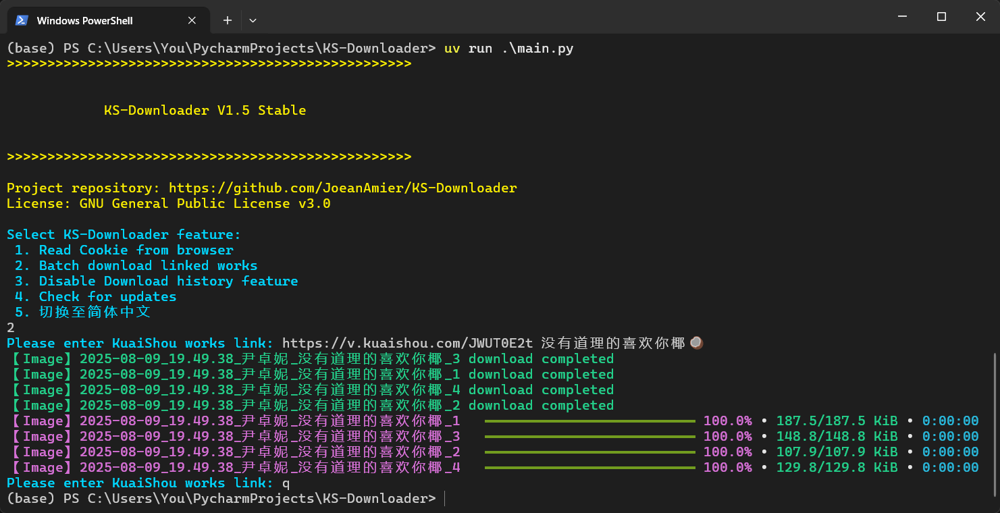

 
<h1>KS-Downloader</h1>

English | <a href="README.md">简体中文</a>

 

 

🔥 <b>KuaiShou Works Download Tool: </b>Completely free and open-source, based on HTTPX module, for downloading KuaiShou watermark-free video and image files!

⭐ Due to the author's limited energy, I was unable to update the English document in a timely manner, and the content may have become outdated, partial translation is machine translation, the translation result may be incorrect, Suggest referring to Chinese documentation. If you want to contribute to translation, we warmly welcome you.

<h1>📑 Project Features</h1>
<ul>
<li>✅ Download watermark-free KuaiShou works</li>
<li>☑️ Download works cover images</li>
<li>☑️ Download works music files</li>
<li>✅ Auto-skip downloaded files</li>
<li>✅ File integrity verification</li>
<li>✅ Persistent works metadata storage</li>
<li>✅ Track downloaded works IDs</li>
<li>✅ Resumable downloads</li>
<li>✅ Dedicated storage folders</li>
<li>✅ Custom filename formats</li>
<li>✅ Browser cookie extraction</li>
<li>✅ Author alias configuration</li>
<li>✅ Archive works by author</li>
<li>✅ Automatic author nickname updates</li>
<li>✅ API integration</li>
<li>☑️ Background clipboard monitoring</li>
</ul>
<h1>📸 Screenshots</h1>

<a href="https://www.bilibili.com/video/BV1LYtbzhESo/">前往 bilibili 观看演示</a>；<a href="https://youtu.be/twiy9cv5snA">前往 YouTube 观看演示</a>

<h1>🥣 Usage Guide</h1>
<h2>🖱 Application Execution</h2>

⭐ Mac OS/Windows 10+ users: Download pre-built packages from <a href="https://github.com/JoeanAmier/KS-Downloader/releases/latest">Releases</a> or <a href="https://github.com/JoeanAmier/KS-Downloader/actions">Actions</a>. Extract and double-click <code>main</code> to run!

⭐ This project includes GitHub Actions for automatic builds - users can compile latest source code into executables anytime!

⭐ For the automatic building executable files tutorial, please refer to the <code>Build of Executable File Guide</code> section of this document. If you need a more detailed step-by-step tutorial with illustrations, please <a href="https://mp.weixin.qq.com/s/TorfoZKkf4-x8IBNLImNuw">check out this article</a>!

<strong>Note: Mac OS executable <code>main</code> may require terminal execution. Limited by testing devices, Mac version hasn't been fully validated.</strong>

Default download path: <code>.\_internal\Volume\Download</code> Configuration file: <code>.\_internal\Volume\config.yaml</code>

<h3>Update Methods</h3>

<strong>Method 1:</strong> Download and extract the files, then copy the old version of the <code>_internal\Volume</code> folder into the new version's <code>_internal</code> folder.

<strong>Method 2:</strong> Download and extract the files (do not run the program), then copy all files and directly overwrite the old version.

<h2>⌨️ Source Code Execution</h2>
<ol>
<li>Install Python interpreter version <code>3.12</code></li>
<li>Download latest source code from repository or <a href="https://github.com/JoeanAmier/KS-Downloader/releases/latest">Releases</a></li>
<li>Open terminal and navigate to project root directory</li>
<li>Install dependencies: <code>pip install -i https://pypi.tuna.tsinghua.edu.cn/simple -r requirements.txt</code></li>
<li>Execute <code>main.py</code> to start</li>
</ol>
<h2>⌨️ Docker Execution</h2>
<ol>
<li>Obtain Image:
<ul>
<li>Method 1: Build using <code>Dockerfile</code></li>
<li>Method 2: Pull image via <code>docker pull joeanamier/ks-downloader</code></li>
<li>Method 3: Pull image via <code>docker pull ghcr.io/joeanamier/ks-downloader</code></li>
</ul>
</li>
<li>Create Container:</li>
<ul>
<li>TUI Mode: <code>docker run --name container_name(optional) -p HostPort:5557 -v ks_downloader_volume:/app/Volume -it &lt;image name&gt;</code></li>
<li>API Mode: <code>docker run --name container_name(optional) -p HostPort:5557 -v ks_downloader_volume:/app/Volume -it &lt;image name&gt; python main.py api</code></li>
 <b>Note:</b> The <code>&lt;image name&gt;</code> here must be consistent with the image name you used in the first step (<code>joeanamier/ks-downloader</code> or <code>ghcr.io/joeanamier/ks-downloader</code>)
</ul>
<li>Run Container:
<ul>
<li>Start: <code>docker start -i [container_name/ID]</code></li>
<li>Restart: <code>docker restart -i [container_name/ID]</code></li>
</ul>
</li>
</ol>

<b>Note:</b> Docker version doesn't support <b>browser cookie reading</b> and <b>clipboard monitoring</b>. Other features remain functional. Please report any anomalies.

<h2>🖥 Server Mode</h2>

<b>Start:</b> Run the command: <code>python .\main.py api</code>

<b>Stop:</b> Press <code>Ctrl</code> + <code>C</code> to stop the server

Open <code>http://127.0.0.1:5557/docs</code> or <code>http://127.0.0.1:5557/redoc</code>; you will see automatically generated interactive API documentation!

<h1>🔗 Supported Links</h1>
<ul>
<li><code>https://www.kuaishou.com/f/share-code</code></li>
<li><code>https://v.kuaishou.com/share-code</code></li>
<li><code>https://www.kuaishou.com/short-video/worksID</code></li>
<li><code>https://kuaishou.cn/short-video/worksID</code></li>
<li><code>https://live.kuaishou.com/u/author-id/worksID</code></li>
 

<b>Recommend using share links; Multiple URLs supported (space separated).</b>

</ul>
<h1>🪟 Terminal Recommendation</h1>

⭐ Use <a href="https://learn.microsoft.com/zh-cn/windows/terminal/install">Windows Terminal</a> (default on Windows 11) for optimal display!

<h1>📜 Additional Notes</h1>
<ul>
<li>Windows requires admin privileges to read Chromium/Chrome/Edge cookies</li>
<li>Work data stored in <code>./Volume/Data/DetailData.db</code> when enabled</li>
<li>Settings and download records in <code>./Volume/KS-Downloader.db</code></li>
<li>The project has a built-in request delay mechanism to avoid excessive request frequency. Code location: <code>./source/tools/sleep.py</code></li>
</ul>

<h1>⚙️ Configuration File</h1>

<code>config.yaml</code> (auto-generated) allows custom settings:

<strong>If features malfunction, configure cookies first!</strong>

<table>
<thead>
<tr>
<th align="center">Parameter</th>
<th align="center">Type</th>
<th align="center">Description</th>
<th align="center">Default</th>
</tr>
</thead>
<tbody>
<tr>
<td align="center">mapping_data</td>
<td align="center">str: str</td>
<td align="center"><a href="#author_archive">#</a>Author alias mapping data, format: <code>author ID: author alias</code></td>
<td align="center">null</td>
</tr>
<tr>
<td align="center">work_path</td>
<td align="center">str</td>
<td align="center">Root path for work data/file storage</td>
<td align="center">Project root path/Volume</td>
</tr>
<tr>
<td align="center">folder_name</td>
<td align="center">str</td>
<td align="center">Storage folder name for works files</td>
<td align="center">Download</td>
</tr>
<tr>
<td align="center">name_format</td>
<td align="center">str</td>
<td align="center"><a href="#fields">#</a>Works file name format, use spaces to separate fields; Supported fields: <code>作品类型</code>、<code>作者昵称</code>、<code>作者ID</code>、<code>作品描述</code>、<code>作品ID</code>、<code>发布日期</code></td>
<td align="center"><code>发布日期 作者昵称 作品描述</code></td>
</tr>
<tr>
<td align="center">name_length</td>
<td align="center">int</td>
<td align="center">Works file name length limit. Text exceeding the limit will be truncated. When setting a large value, please ensure the system supports this length</td>
<td align="center"><code>128</code></td>
</tr>
<tr>
<td align="center">cookie</td>
<td align="center">str</td>
<td align="center">KuaiShou web interface Cookie <b>(no login required)</b></td>
<td align="center">Dynamically fetched</td>
</tr>
<tr>
<td align="center">proxy</td>
<td align="center">str</td>
<td align="center">Set program proxy</td>
<td align="center">null</td>
</tr>
<tr>
<td align="center">data_record</td>
<td align="center">bool</td>
<td align="center">Save works data to file (SQLite format)</td>
<td align="center">false</td>
</tr>
<tr>
<tr>
<td align="center">max_workers</td>
<td align="center">int</td>
<td align="center">Maximum concurrent download tasks</td>
<td align="center">4</td>
</tr>
<tr>
<td align="center"><del>cover</del>（Deactivate）</td>
<td align="center">str</td>
<td align="center">Cover download format (JPEG/WEBP), empty string disables</td>
<td align="center">Empty string</td>
</tr>
<tr>
<td align="center"><del>music</del>（Deactivate）</td>
<td align="center">bool</td>
<td align="center">Download works music track</td>
<td align="center">false</td>
</tr>
<tr>
<td align="center">max_retry</td>
<td align="center">int</td>
<td align="center">Max retry attempts on failure (seconds)</td>
<td align="center">5</td>
</tr>
<tr>
<td align="center">timeout</td>
<td align="center">int</td>
<td align="center">Request timeout limit (seconds)</td>
<td align="center">10</td>
</tr>
<tr>
<td align="center">user_agent</td>
<td align="center">str</td>
<td align="center">浏览器 User Agent</td>
<td align="center">默认 UA</td>
</tr>
<tr>
<td align="center">chunk</td>
<td align="center">int</td>
<td align="center">Download chunk size in bytes</td>
<td align="center">2097152 (2 MB)</td>
</tr>
<tr>
<td align="center">folder_mode</td>
<td align="center">bool</td>
<td align="center">Store files in individual folders (folder matches filename)</td>
<td align="center">false</td>
</tr>
<tr>
<td align="center">author_archive</td>
<td align="center">bool</td>
<td align="center"><a href="#author_archive">#</a>Whether to store each author's works in separate folders; Folder name format: <code>authorID_authorNickname</code></td>
<td align="center">false</td>
</tr>
</tbody>
</table>

name_format instructions (Currently only supports Chinese values) :

<ul>
<li><code>作品ID</code>: Works ID</li>
<li><code>作品描述</code>: Works Description</li>
<li><code>作品类型</code>: Works Type</li>
<li><code>发布时间</code>: Publish Time</li>
<li><code>作者昵称</code>: Author Nickname</li>
<li><code>作者ID</code>: Author ID</li>
</ul>

When <code>author_archive</code> is set to <code>true</code>, the program will store each author's works in dedicated folders. If an author's nickname changes, the program automatically updates the nickname portion in existing downloaded filenames!

Additionally, you can configure author aliases through the <code>mapping_data</code> parameter. When an alias is set, the program will use your custom alias instead of the original nickname in filenames!

# 📦 Build of Executable File Guide

This guide will walk you through forking this repository and executing GitHub Actions to automatically build and package
the program based on the latest source code!

---

## Steps to Use

### 1. Fork the Repository

1. Click the **Fork** button at the top right of the project repository to fork it to your personal GitHub account
2. Your forked repository address will look like this: `https://github.com/your-username/this-repo`

---

### 2. Enable GitHub Actions

1. Go to the page of your forked repository
2. Click the **Settings** tab at the top
3. Click the **Actions** tab on the right
4. Click the **General** option
5. Under **Actions permissions**, select **Allow all actions and reusable workflows** and click the **Save** button

---

### 3. Manually Trigger the Build Process

1. In your forked repository, click the **Actions** tab at the top
2. Find the workflow named **构建可执行文件**
3. Click the **Run workflow** button on the right:
    - Select the **master** or **develop** branch
    - Click **Run workflow**

---

### 4. Check the Build Progress

1. On the **Actions** page, you can see the execution records of the triggered workflow
2. Click on the run record to view detailed logs to check the build progress and status

---

### 5. Download the Build Result

1. Once the build is complete, go to the corresponding run record page
2. In the **Artifacts** section at the bottom of the page, you will see the built result file
3. Click to download and save it to your local machine to get the built program

---

## Notes

1. **Resource Usage**:
    - GitHub provides free build environments for Actions, with a monthly usage limit (2000 minutes) for free-tier
      users

2. **Code Modifications**:
    - You are free to modify the code in your forked repository to customize the build process
    - After making changes, you can trigger the build process again to get your customized version

3. **Stay in Sync with the Main Repository**:
    - If the main repository is updated with new code or workflows, it is recommended that you periodically sync your
      forked repository to get the latest features and fixes

---

## Frequently Asked Questions

### Q1: Why can't I trigger the workflow?

A: Please ensure that you have followed the steps to **Enable Actions**. Otherwise, GitHub will prevent the workflow
from running

### Q2: What should I do if the build process fails?

A:

- Check the run logs to understand the cause of the failure
- Ensure there are no syntax errors or dependency issues in the code
- If the problem persists, please open an issue on
  the [Issues page](https://github.com/JoeanAmier/KS-Downloader/issues)

### Q3: Can I directly use the Actions from the main repository?

A: Due to permission restrictions, you cannot directly trigger Actions from the main repository. Please use the forked
repository to execute the build process

<h1>⚠️ Disclaimer</h1>
<ol>
<li>The user's use of this project is entirely at their own discretion and responsibility. The author assumes no liability for any losses, claims, or risks arising from the user's use of this project.</li>
<li>The code and functionalities provided by the author of this project are based on current knowledge and technological developments. The author strives to ensure the correctness and security of the code according to existing technical capabilities but does not guarantee that the code is entirely free of errors or defects.</li>
<li>All third-party libraries, plugins, or services relied upon by this project follow their respective open-source or commercial licenses. Users must review and comply with those license agreements. The author assumes no responsibility for the stability, security, or compliance of third-party components.</li>
<li>Users must strictly comply with the requirements of the <a href="https://github.com/JoeanAmier/KS-Downloader/blob/master/LICENSE">GNU General Public License v3.0</a> when using this project and properly indicate that the code was used under the <a href="https://github.com/JoeanAmier/KS-Downloader/blob/master/LICENSE">GNU General Public License v3.0</a>.</li>
<li>When using the code and features of this project, users must independently research relevant laws and regulations and ensure their actions are legal and compliant. Any legal liabilities or risks arising from violations of laws and regulations shall be borne solely by the user.</li>
<li>Users must not use this tool to engage in any activities that infringe intellectual property rights, including but not limited to downloading or distributing copyright-protected content without authorization. The developers do not participate in, support, or endorse any unauthorized acquisition or distribution of illegal content.</li>
<li>This project assumes no responsibility for the compliance of any data processing activities (including collection, storage, and transmission) conducted by users. Users must comply with relevant laws and regulations and ensure that their processing activities are lawful and proper. Legal liabilities resulting from non-compliant operations shall be borne by the user.</li>
<li>Under no circumstances may users associate the author, contributors, or other related parties of this project with their usage of the project, nor may they hold these parties responsible for any loss or damage arising from such usage.</li>
<li>The author of this project will not provide a paid version of the KS-Downloader project, nor will they offer any commercial services related to the KS-Downloader project.</li>
<li>Any secondary development, modification, or compilation based on this project is unrelated to the original author. The original author assumes no liability for any consequences resulting from such secondary development. Users bear full responsibility for all outcomes arising from such modifications.</li>
<li>This project grants no patent licenses; if the use of this project leads to patent disputes or infringement, the user bears all associated risks and responsibilities. Without written authorization from the author or rights holder, users may not use this project for any commercial promotion, marketing, or re-licensing.</li>
<li>The author reserves the right to terminate service to any user who violates this disclaimer at any time and may require them to destroy all obtained code and derivative works.</li>
<li>The author reserves the right to update this disclaimer at any time without prior notice. Continued use of the project constitutes acceptance of the revised terms.</li>
</ol>
<b>Before using the code and functionalities of this project, please carefully consider and accept the above disclaimer. If you have any questions or disagree with the statement, please do not use the code and functionalities of this project. If you use the code and functionalities of this project, it is considered that you fully understand and accept the above disclaimer, and willingly assume all risks and consequences associated with the use of this project.</b>

<h1>✉️ Contact the Author</h1>
<ul>
<li>Author's Email：yonglelolu@foxmail.com</li>
<li>Author's WeChat: Downloader_Tools</li>
<li><b>Discord Community</b>: <a href="https://discord.com/invite/ZYtmgKud9Y">Click to Join the Community</a></li>
</ul>

✨ <b>Other Open Source Projects by the Author:</b>

<ul>
<li><b>DouK-Downloader（抖音、TikTok）</b>：<a href="https://github.com/JoeanAmier/TikTokDownloader">https://github.com/JoeanAmier/TikTokDownloader</a></li>
<li><b>XHS-Downloader（小红书、XiaoHongShu、RedNote）</b>：<a href="https://github.com/JoeanAmier/XHS-Downloader">https://github.com/JoeanAmier/XHS-Downloader</a></li>
</ul>
<h1>⭐ Star History</h1>

<h1>♥️ Support the Project</h1>

If <b>KS-Downloader</b> has been helpful to you, please consider giving it a <b>Star</b> ⭐. Thank you for your support!

<table>
<thead>
<tr>
<th align="center">微信(WeChat)</th>
<th align="center">支付宝(Alipay)</th>
</tr>
</thead>
<tbody><tr>
<td align="center"></td>
<td align="center"></td>
</tr>
</tbody>
</table>

If you are willing, you may consider making a donation to provide additional support for <b>KS-Downloader</b>!

<h1>🌟 Contribution Guidelines</h1>

<strong>Welcome to contributing to this project! To keep the codebase clean, efficient, and easy to maintain, please read the following guidelines carefully to ensure that your contributions can be accepted and integrated smoothly.</strong>

<ul>
<li>Before starting development, please pull the latest code from the <code>develop</code> branch as the basis for your modifications; this helps avoid merge conflicts and ensures your changes are based on the latest state of the project.</li>
<li>If your changes involve multiple unrelated features or issues, please split them into several independent commits or pull requests.</li>
<li>Each pull request should focus on a single feature or fix as much as possible, to facilitate code review and testing.</li>
<li>Follow the existing coding style; make sure your code is consistent with the style already present in the project; please use the Ruff tool to maintain code formatting standards.</li>
<li>Write code that is easy to read; add appropriate annotation to help others understand your intentions.</li>
<li>Each commit should include a clear and concise commit message describing the changes made. The commit message should follow this format: <code>&lt;type&gt;: &lt;short description&gt;</code></li>
<li>When you are ready to submit a pull request, please prioritize submitting them to the <code>develop</code> branch; this provides maintainers with a buffer zone for additional testing and review before final merging into the <code>master</code> branch.</li>
<li>It is recommended to communicate with the author before starting development or when encountering questions to ensure alignment in direction and avoid redundant efforts or unnecessary commits.</li>
</ul>

<strong>Reference materials:</strong>

<ul>
<li><a href="https://www.contributor-covenant.org/version/2/1/code_of_conduct/">Contributor Covenant</a></li>
<li><a href="https://opensource.guide/how-to-contribute/">How to Contribute to Open Source</a></li>
</ul>

# 💡 Project References

* https://github.com/moyada/stealer
* https://github.com/encode/httpx/
* https://github.com/Textualize/rich
* https://github.com/Tinche/aiofiles
* https://github.com/omnilib/aiosqlite
* https://github.com/pyinstaller/pyinstaller
* https://github.com/thewh1teagle/rookie
* https://github.com/lxml/lxml
* https://github.com/yaml/pyyaml
* https://github.com/carpedm20/emoji/
